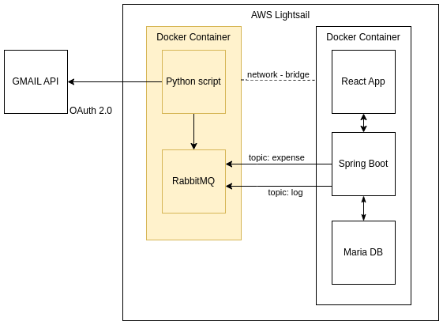

# Budget keeper (Python part)

The purpose of the application is to keep the household budget in check. The project consists of two parts:

- **a Python script that reads emails from the bank and dumps the parsed information into a RabbitMQ stream**
- a Spring/React application that allows you to display and edit expenses. In addition, charts and pivots ;)

  

Spring/React part: https://github.com/jezinka/budget-keeper-spring
